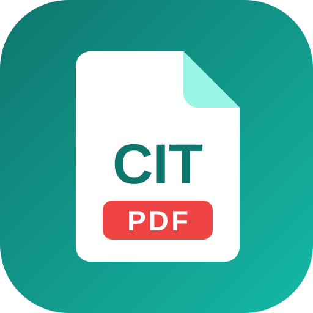

<p align="center"></p>
<h1 align="center">CIT-PDF</h1>

**CIT-PDF** là bộ công cụ PDF dành cho máy tính Windows. Mọi thao tác xử lý đều chạy ngay trên máy của bạn; tệp không được gửi lên máy chủ nào.

CIT-PDF là bản sửa đổi (fork) của [BentoPDF](https://github.com/alam00000/bentopdf), do Cường IT đóng gói lại thành ứng dụng desktop và phát hành theo giấy phép **AGPL-3.0**. Đây không phải sản phẩm chính thức của BentoPDF.

## Tính năng

- Hơn 50 công cụ PDF kế thừa từ BentoPDF: gộp, tách, xoay, sắp xếp trang, nén, chuyển đổi sang và từ PDF, ký số, đặt mật khẩu, OCR, chỉnh sửa nội dung.
- Giao diện desktop riêng: thanh bên có tìm kiếm, công cụ yêu thích, công cụ dùng gần đây và nhóm công cụ.
- Mở tệp `.pdf` trực tiếp từ hệ điều hành ("Open with CIT-PDF"); mở nhiều tệp vẫn chỉ dùng một cửa sổ.
- Giao diện mặc định tiếng Việt, có thể chuyển sang ngôn ngữ khác.

## Cài đặt

Tải bản cài tại trang [Releases](https://github.com/Cuongyd196/cit-pdf/releases).

Dành cho Windows 10 và 11 (64-bit).

| Tệp                                            | Ghi chú                                |
| ---------------------------------------------- | -------------------------------------- |
| `CIT-PDF-<phiên bản>-Windows-x64-Setup.exe`    | Bản cài, không cần quyền Administrator |
| `CIT-PDF-<phiên bản>-Windows-x64-Portable.exe` | Bản Portable, chạy thẳng không cần cài |

### Module tải khi dùng lần đầu

Bộ cài chỉ chứa phần lõi. Các bộ xử lý nặng được tải về khi bạn mở công cụ cần đến chúng lần đầu, sau đó lưu trên máy và dùng được khi không có mạng.

| Module             | Nguồn tải              | Kiểm tra toàn vẹn |
| ------------------ | ---------------------- | ----------------- |
| PyMuPDF            | npm registry           | SHA-512           |
| Ghostscript        | npm registry           | SHA-512           |
| LibreOffice        | kho mã nguồn của dự án | SHA-256 từng tệp  |
| CoherentPDF (cpdf) | có sẵn trong bộ cài    | không cần tải     |

## Build từ mã nguồn

Cần Node.js 20 trở lên.

```bash
git clone https://github.com/Cuongyd196/cit-pdf.git
cd cit-pdf
npm install

npm run desktop            # build và chạy ứng dụng
npm run desktop:build      # chỉ build
npm run desktop:dist       # đóng gói bộ cài Windows vào release/
```

Lưu ý: trong terminal của VS Code, biến `ELECTRON_RUN_AS_NODE=1` được đặt sẵn và làm Electron chạy như Node thường. Hãy bỏ biến này trước khi chạy `npm run desktop`.

Chi tiết về kiến trúc bản desktop nằm trong [DESKTOP.md](DESKTOP.md). Hướng dẫn gốc của BentoPDF cho bản web (Docker, self-host, cấu hình WASM) được giữ nguyên tại [README.bentopdf.md](README.bentopdf.md).

## Thay đổi so với BentoPDF

CIT-PDF dựa trên BentoPDF 2.8.8 và được sửa đổi trong năm 2026:

- Thêm lớp vỏ Electron (`desktop/`) với giao thức `app://` riêng để chạy ứng dụng không cần máy chủ web.
- Thêm trình quản lý module (`desktop/src/modules-manager.ts`) tải, kiểm tra mã băm và lưu các bộ xử lý WASM trên máy.
- Thêm giao diện desktop (`src/js/desktop/`, thanh bên và thanh trạng thái) cùng hai trang `cit-about.html` và `cit-settings.html`.
- Đổi tên, logo và ngôn ngữ mặc định (tiếng Việt).
- Thêm script build và cấu hình đóng gói (`scripts/build-desktop.mjs`, `electron-builder.json`).

Phần xử lý PDF của BentoPDF được giữ nguyên, kể cả dòng producer trong metadata của các tệp PDF xuất ra.

## Giấy phép

CIT-PDF được phát hành theo [GNU AGPL-3.0](LICENSE). Bạn được dùng, sửa đổi và phân phối lại, với điều kiện bản phân phối của bạn cũng công khai mã nguồn theo AGPL-3.0.

- Bản quyền phần mã gốc: © BentoPDF Contributors.
- Bản quyền phần sửa đổi: © 2026 Cường IT.
- Mã nguồn tương ứng với từng bản phát hành nằm tại tag cùng số phiên bản trong kho này.

BentoPDF còn có giấy phép thương mại riêng cho ai muốn dùng trong sản phẩm đóng nguồn; xem [bentopdf.com/licensing.html](https://bentopdf.com/licensing.html). CIT-PDF không cấp giấy phép đó.

### Thành phần bên thứ ba

| Thành phần             | Giấy phép | Mã nguồn                                                                              |
| ---------------------- | --------- | ------------------------------------------------------------------------------------- |
| BentoPDF               | AGPL-3.0  | [alam00000/bentopdf](https://github.com/alam00000/bentopdf)                           |
| PyMuPDF                | AGPL-3.0  | [pymupdf/PyMuPDF](https://github.com/pymupdf/PyMuPDF)                                 |
| Ghostscript            | AGPL-3.0  | [ArtifexSoftware/ghostpdl](https://github.com/ArtifexSoftware/ghostpdl)               |
| CoherentPDF (cpdf)     | AGPL-3.0  | [coherentgraphics/coherentpdf.js](https://github.com/coherentgraphics/coherentpdf.js) |
| LibreOffice            | MPL-2.0   | [libreoffice.org](https://www.libreoffice.org/about-us/source-code/)                  |
| Inter (font giao diện) | OFL-1.1   | [rsms/inter](https://github.com/rsms/inter)                                           |

## Ghi nhận

Cảm ơn nhóm tác giả và cộng đồng BentoPDF đã xây dựng bộ công cụ gốc. Lỗi liên quan đến bản desktop CIT-PDF xin báo tại [Issues](https://github.com/Cuongyd196/cit-pdf/issues) của kho này, không báo cho BentoPDF.
